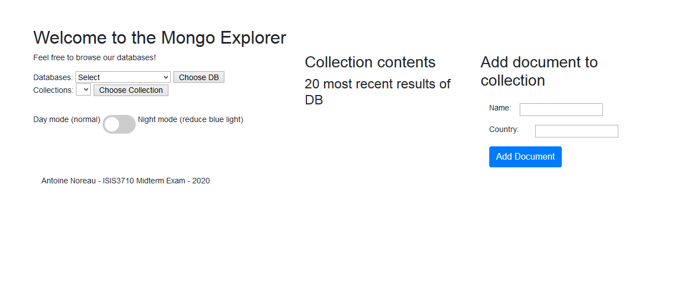

# The Mongo Explorer

Midterm exam of Web Development class ISIS3710 at Universidad de los Andes.

OPTION 1: Application that lists all databases in a Mongo server, and allows to browse their collections and contents.
The app will be deployed on herokuapp.com and will allow add registers to existing collections. Due Saturday March 7th 2020, 8AM.

## 1: Objectives and technologies used

ADD DESCRIPTION

### Technologies used

This project is developed mainly using Javascript, HTML and CSS. Node.js is used to set up the web server, MongoDB manages the data and Express.js was used to set up the basis of the project. Passport.js is used to manage the authentication process, and Bootstrap provides fonts and templates for front-end cosmetics.

## 2: Walk-through / How to deploy

### 2.1: Prerequisites

After cloning the project repository to a local folder, you'll need to install these few dependencies and softwares:

- Node.js : You'll absolutely need this Javascript runtime, since everything server-side is based upon it. The Node Package Manager (npm) is very useful to include more Node modules. However, needed modules are already included in the project repo. You can find it at this link : https://nodejs.org/en/download/

- MongoDB : You'll also need to install and run you own Mongo database to host your ingredient list. Using npm, adding mongodb to your project is fairly easy. This package is however already included in the node-modules folder, so you won't have to install it again. We suggest download MongoDB Compass, which provides an intuitive UI to manage database creations and content. The project expects a mongoDB database to be running on localhost:27017, with two collections (recipes and ingredients) available. 

You will of course need a web browser, such as Firefox, to load the front-end part of our project. Finally, to use and modify the project for personal use, you'll need a text/code editor, such as Visual Studio Code or SublimeText.  

### 2.2: How to install

ADD DETAILS

Dependencies: 

```
npm install

```

### 2.3: How to launch

ADD DETAILS

```
nodemon index
```

## 3: Author

This project is made by Antoine Noreau, for the Web Developement Class at Universidad de Los Andes, Colombia. 

Antoine Noreau // https://github.com/antonoro

## 4: Screenshot of main page



## 5: Licence

This project is licensed under the terms of the MIT <a href="./LICENSE.md">License</a>.
